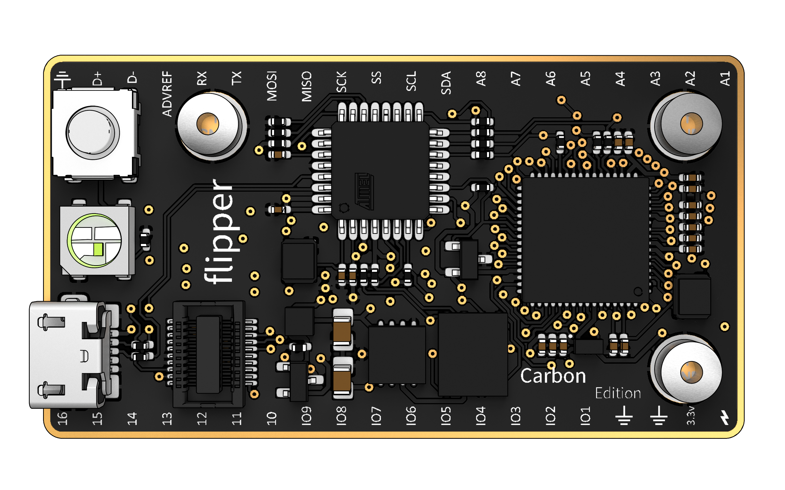

# What is Flipper?

Flipper is an embedded development platform that aims to make it simple to
build powerful hardware electronics projects quickly.
Flipper introduces a new perspective to hardware projects by shifting the
focus of the developer away from the limitations of embedded systems and onto
the goals of the project itself. It does this by providing a software library
that allows programs on a host machine to execute functions on Flipper
remotely. A host machine can be a desktop computer, a smartphone, or even a
server in the cloud. This means that you can write Flipper applications for
any platform - and using any programming language.

## Hardware Overview

Flipper's hardware design helps enable its first-class support for remote
applications, and provides several extra capabilities that further empower
hardware developers.

Flipper is equipped with two processors.
The larger and more powerful of the two is responsible for executing user
programs and is connected to the board pinout. The smaller processor acts as
a sidekick, interacting with host machines to provide live interactivity
without bogging down the main processor.

The board also has an expansion bus that exposes all of Flipper's primary
pinouts. This means that the hardware capabilities of the platform can
continue improving as new expansion boards are created. Some expansions
we're anticipating to see soon include Wifi and Bluetooth adapters.

Finally, Flipper has a unique form factor featuring board-flush female pin
headers. This means that the board is super thin, but can be mounted on a
breadboard using the included right-angle header pins.

## The Flipper Developer Experience

Flipper's feature set gives us a lot of opportunities to make life easier for
embedded developers.

